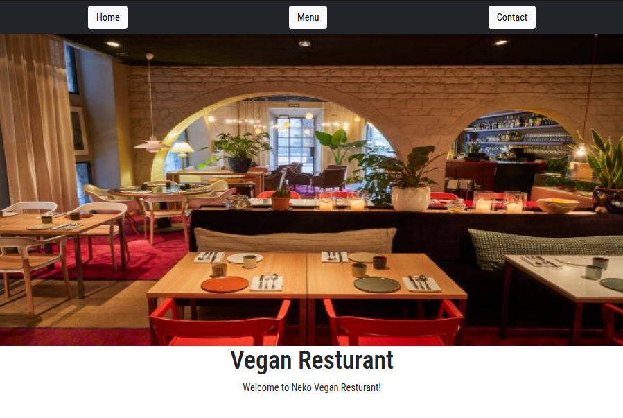

# Resturant-js

> A restaurant site that uses tabbed browsing to access different tabs



## Live Demo
[Live Demo link](https://abdelrhmanamin.github.io/Resturant-js/#)

## Getting Started

To get a local copy up and running follow these simple example steps.

### Prerequisites

- Live Server plugin for Visual Studio Code

### Setup

1- Clone the repository

```
    git clone https://github.com/elberthcorniell/restaurant-js.git
```

2- Open the folder on VS Code.

```
    cd restaurant-js
    code .
```

3- Right click the dist/index.html file and click on "Open With Live Server"

4- Everything should be running by now.

### JavaScript Build

1- Run the next on your terminal in the repository folder

```
    npm run webpack
```

## Author

😎 **Abdo Amin**

- GitHub: [@Abdelrhman-Amin](https://github.com/AbdelrhmanAmin)
- Twitter: [@Abdo Amin](https://twitter.com/AbdoAmi60489112)
- LinkedIn: [@Abdo Amin](https://www.linkedin.com/in/abdo-amin-ab786a1b0/)

## Show your support

Give a ⭐️ if you like this project!

## Acknowledgments

- [Microverse](https://www.microverse.org/).
